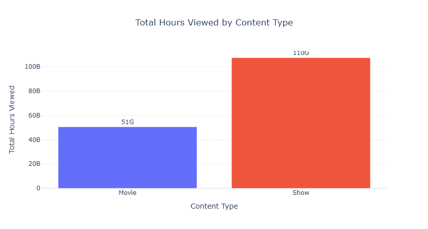
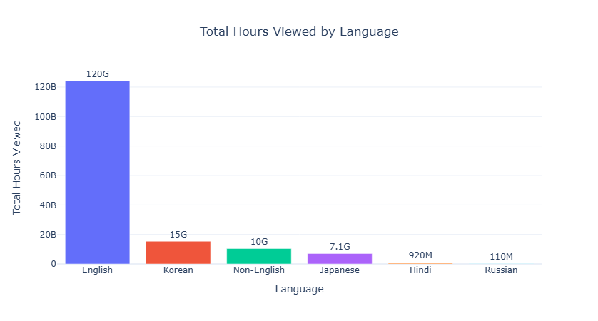
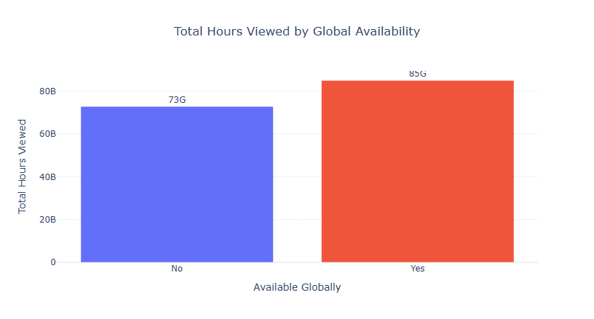
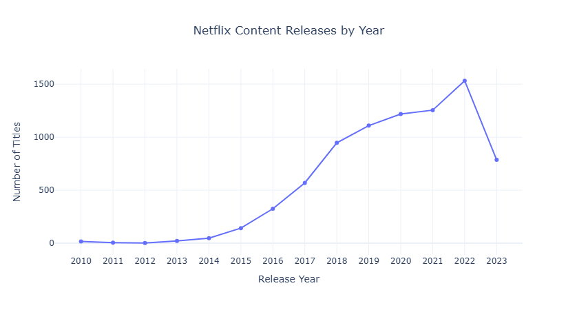
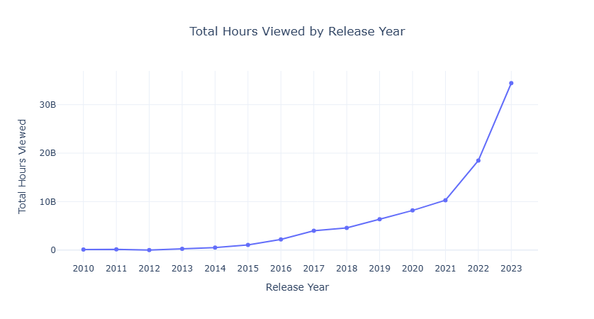
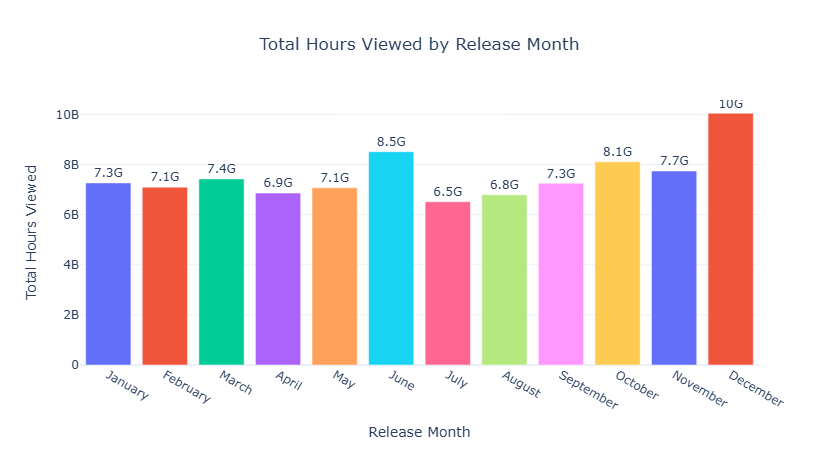
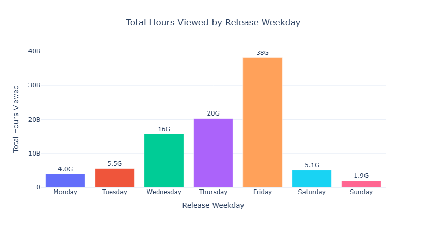
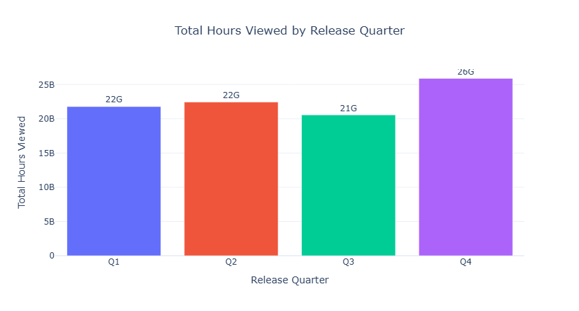

# Netflix Content Performance Analysis

## Business Objective

Netflix invests billions in content production every year. This project analyzes content performance to identify audience trends and provide data-driven business recommendations.

---

## Problem Statement

Analyze Netflix's content catalog to identify factors influencing audience engagement, content performance, and release strategy.

---

## Tech Stack

- Python
- Pandas
- NumPy
- Plotly
- Jupyter Notebook

---

## Dataset

- Netflix Content Dataset (Kaggle)

---

## Business Questions

### Q1. Which Content Type Generates the Highest Audience Engagement?

---

### Q2. Which Languages Generate the Highest Audience Engagement?

---

### Q3. Does Global Availability Influence Audience Engagement?

---

### Q4. How Has Netflix's Content Release Strategy Evolved Over Time?

---

### Q5. Which Release Years Generated the Highest Audience Engagement?

---

### Q6. Which Months Are Best for Releasing Content?

---

### Q7. Which Weekdays Generate the Highest Audience Engagement?

---

### Q8. Which Release Quarters Generate the Highest Audience Engagement?

---

## Future Scope

- Build an interactive Power BI/Tableau dashboard.
- Perform predictive analytics for future content performance.
- Analyze subscriber retention and viewing behavior.
- Integrate real-time streaming analytics.